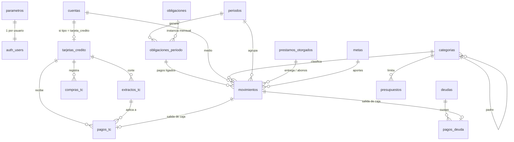

# 05 · Modelo de datos (Supabase / Postgres)

> Diseño lógico listo para convertirse en migraciones en la Fase 0–1. Convenciones: `snake_case`, PK `id uuid default gen_random_uuid()`, `user_id uuid not null default auth.uid()` con RLS en **todas** las tablas, `created_at` / `updated_at timestamptz`, montos `numeric(14,2)`.

---

## 1. Diagrama entidad-relación



## 2. Enumeraciones

| Enum | Valores |
|---|---|
| `tipo_cuenta` | `ahorros`, `corriente`, `efectivo`, `billetera`, `tarjeta_credito`, `cooperativa`, `inversion` |
| `tipo_categoria` | `ingreso`, `gasto` |
| `bolsa_503020` | `necesidad`, `deseo`, `ahorro_deuda`, `no_aplica` |
| `frecuencia` | `mensual`, `bimestral`, `trimestral`, `semestral`, `anual` |
| `tipo_obligacion` | `servicio`, `arriendo`, `telecom`, `tarjeta`, `deuda`, `cooperativa`, `seguridad_social`, `ingreso_esperado`, `ahorro`, `otro` |
| `estado_periodo` | `abierto`, `cerrado` |
| `estado_obligacion` | `pendiente`, `parcial`, `pagada`, `vencida`, `omitida` (vencida es calculada) |
| `tipo_movimiento` | `ingreso`, `gasto`, `pago_tc`, `pago_deuda`, `aporte`, `prestamo_otorgado`, `recuperacion_prestamo`, `desembolso_deuda`, `transferencia`, `reembolso_devtopia` |
| `tipo_compra_tc` | `compra`, `avance`, `devolucion`, `ajuste` |
| `tipo_pago_tc` | `total`, `minimo`, `otro`, `inferior_minimo` |
| `estado_extracto` | `pendiente`, `pagado_total`, `minimo_cubierto`, `parcial`, `vencido` |
| `tipo_deuda` | `banco`, `libranza`, `cooperativa`, `persona`, `otro` |
| `tipo_meta` | `ahorro`, `fondo_emergencia`, `pagar_deuda`, `compra` |

## 3. Tablas

### 3.1 `parametros` (1 fila por usuario)
| Campo | Tipo | Nota |
|---|---|---|
| user_id | uuid PK | |
| moneda | text | `COP` |
| dia_inicio_mes | smallint | 1 por defecto |
| umbral_conciliacion_abs | numeric | 20000 |
| umbral_conciliacion_pct | numeric | 0.05 |
| imputacion_tc | text | `cargos_primero` |
| meta_ahorro_pct | numeric | 0.20 |
| umbrales_salud | jsonb | Bandas de indicadores editables |
| tasa_usura_ea | numeric(7,4) | (F5) Tasa de usura de referencia, editable; avisa si una deuda la supera |
| seguridad_social | jsonb | `{ibc_pct, salud_pct, pension_pct, arl_clase, smmlv}` editables por año |
| recordatorios_email | boolean | |

### 3.2 `cuentas`
id · user_id · nombre · tipo `tipo_cuenta` · entidad · saldo_inicial · fecha_saldo_inicial · color · activa · orden

### 3.3 `tarjetas_credito`
id · user_id · cuenta_id (FK único) · franquicia · ultimos4 `char(4)` · cupo · dia_corte `smallint` · dia_limite_pago `smallint` · tasa_ea_ref · cuota_manejo_ref · cuenta_pago_default_id · activa

### 3.4 `categorias`
id · user_id · tipo `tipo_categoria` · grupo · nombre · padre_id (subcategorías) · icono · color · bolsa `bolsa_503020` · es_fija · requiere_descripcion · es_sistema · activa · orden
> `seed.sql` crea las categorías del doc 01 (sección 5) y la categoría de sistema **Costos financieros TC**.

### 3.5 `periodos`
id · user_id · mes `date` (siempre día 1, único por usuario) · estado · cerrado_en · reabierto_en · notas · snapshot `jsonb`

### 3.6 `obligaciones` (plantillas recurrentes)
id · user_id · nombre · tipo `tipo_obligacion` · categoria_id · monto_estimado · es_variable · estimar_con_promedio `boolean` · dia_vencimiento · frecuencia · mes_ancla `date` (para bimestral/anual) · cuenta_default_id · referencia_pago (n.º contrato/convenio) · tarjeta_id (si tipo=tarjeta) · deuda_id (si tipo=deuda) · fecha_inicio · fecha_fin · activa · orden

### 3.7 `obligaciones_periodo` (instancias)
id · user_id · obligacion_id · periodo_id · nombre (copia) · monto_esperado · fecha_vencimiento · estado_manual (`omitida` + motivo) · arrastrada_de_id · extracto_id (tarjetas) · nota
**Único:** `(obligacion_id, periodo_id)` → idempotencia.

### 3.8 `movimientos`
| Campo | Tipo | Nota |
|---|---|---|
| id, user_id | uuid | |
| periodo_id | uuid | derivado de fecha (trigger) |
| fecha | date | |
| tipo | `tipo_movimiento` | |
| monto | numeric(14,2) | siempre positivo; el tipo define el signo |
| cuenta_id | uuid | origen/destino |
| cuenta_destino_id | uuid | solo transferencias |
| categoria_id | uuid | |
| obligacion_periodo_id | uuid null | pago de obligación |
| prestamo_otorgado_id | uuid null | |
| meta_id | uuid null | aporte a meta |
| descripcion | text | obligatoria si la categoría lo exige |
| comercio | text | |
| reembolsable | boolean | Devtopia |
| reembolsado_por_id | uuid null | movimiento de reembolso |
| adjunto_path | text | Storage |
| etiquetas | text[] | |

### 3.9 `compras_tc`
id · user_id · tarjeta_id · periodo_id (por fecha) · fecha · tipo `tipo_compra_tc` · descripcion · comercio · categoria_id · monto (COP; negativo en devolución) · num_cuotas (1–48) · moneda · monto_origen · trm · adjunto_path
> **Implementado (F2):** `monto` es siempre positivo y el tipo da el signo (devolución resta); solo `ajuste` lleva signo propio y exige descripción. Se agregan `cuenta_destino_id` (a dónde llegó un avance) y `reembolsable`. Categoría obligatoria en compra/devolución, nula en avance/ajuste.

### 3.10 `extractos_tc`
id · user_id · tarjeta_id · fecha_corte · fecha_limite_pago · pago_total_banco · pago_minimo_banco · intereses · cuota_manejo · seguros · otros_declarados · **saldo_sistema_al_corte** (calc) · **otros_generados** (calc) · **capital_facturado** (calc) · **diferencia_no_explicada** (calc) · estado (calc) · alerta (calc, text)
**Único:** `(tarjeta_id, fecha_corte)`

### 3.11 `pagos_tc`
id · user_id · tarjeta_id · extracto_id (calc/elegido) · movimiento_id (FK a la salida de caja) · fecha · monto · tipo_elegido `tipo_pago_tc` · **tipo_calculado** · **imputado_otros** · **imputado_capital** · **saldo_a_favor**
> **Implementado (F2):** `cuenta_origen_id` y `nota`. `extracto_id` es solo calculado (extracto vigente a la fecha). El trigger crea/actualiza/borra el movimiento `pago_tc` (no se puede crear ni editar uno a mano). `extractos_tc` agrega `minimo_estimado`, `pagado` y `periodo_id` (mes del corte); `obligaciones_periodo` agrega `extracto_id` (la obligación "Pago <tarjeta>" nace del extracto, en el mes de su fecha límite, con monto = pago mínimo).

### 3.12 `deudas` (préstamos recibidos y créditos)
id · user_id · acreedor · tipo `tipo_deuda` · monto_original · fecha_desembolso · tasa_ea · plazo_meses · cuota_pactada · dia_pago · incluye_seguro · activa · notas
> **Implementado (F3):** `nombre`, `cuota` (capital + intereses), `seguro_mensual` (en vez de `incluye_seguro`), `aporte_mensual` + `cuenta_aportes_id` (cooperativa), `cuenta_pago_default_id`, `saldo_inicial` + `fecha_saldo_inicial` (capital pendiente al empezar a registrarla), `cuenta_desembolso_id` + `movimiento_desembolso_id` (desembolso a una cuenta, movimiento `desembolso_deuda`). `obligaciones.deuda_id` liga la plantilla mensual de la cuota.

### 3.13 `pagos_deuda`
id · user_id · deuda_id · movimiento_id · fecha · monto · a_capital · a_intereses · a_seguros_otros
> **Implementado (F3):** `a_seguros` y `a_aporte`; el desglose debe sumar el monto (check). El trigger crea el movimiento `pago_deuda` (monto − aporte) y, si hay aporte, un movimiento `aporte` hacia la cuenta de aportes (`movimiento_aporte_id`). Guarda `cuenta_origen_id`, `obligacion_periodo_id` y `nota`.

### 3.14 `prestamos_otorgados` (cuentas por cobrar)
id · user_id · deudor · monto · fecha · fecha_esperada · tasa (opcional) · estado (`vigente`, `pagado`, `castigado`) · notas
> Entrega = movimiento `prestamo_otorgado`; abonos = movimientos `recuperacion_prestamo`.
> **Implementado (F3):** `cuenta_origen_id`, `movimiento_id` (entrega creada por trigger), `castigado_en` + `motivo_castigo` (en vez de `estado`; pagado/vencido se calculan) y `movimientos.prestamo_otorgado_id`. **Reembolsos Devtopia:** `movimientos.reembolsado_por_id` y `compras_tc.reembolsado_por_id` apuntan al movimiento `reembolso_devtopia` (función `registrar_reembolso`); marcarlo no cuenta como editar un mes cerrado.

### 3.15 `aportes_cooperativa`
Se modela con movimientos `aporte` a una cuenta tipo `cooperativa` (su saldo = ahorro). El crédito cooperativo es una fila en `deudas` con tipo `cooperativa`. Una obligación puede tener **dos componentes** (aporte + cuota) desglosados al pagar.

### 3.16 `presupuestos`
id · user_id · periodo_id (null = plantilla base) · categoria_id · monto · **Único** `(periodo_id, categoria_id)`
> **Implementado (F4):** únicos parciales `(user_id, periodo_id, categoria_id)` y `(user_id, categoria_id) where periodo_id is null`; trigger `validar_presupuesto` (mes cerrado de solo lectura, dueño, solo categorías de gasto); `guardar_presupuesto(p_periodo, p_items)` reemplaza las líneas del mes o de la plantilla. Un mes sin líneas propias usa la plantilla. La línea de una categoría padre cubre sus subcategorías sin línea propia.

### 3.17 `metas`
id · user_id · nombre · tipo `tipo_meta` · monto_objetivo · fecha_objetivo · cuenta_id (dónde se guarda) · deuda_id (si pagar_deuda) · activa
> **Implementado (F5):** además `aporte_mensual` (para estimar la fecha) y `notas`. `pagar_deuda` exige `deuda_id` y las demás `cuenta_id` (nunca una tarjeta de crédito; trigger `validar_meta`). La vista `v_metas` calcula `actual` = saldo de la cuenta, o objetivo − saldo de capital de la deuda. Los aportes son transferencias a la cuenta de la meta (no hay tabla de aportes).

### 3.18 `bitacora` (auditoría ligera)
id · user_id · entidad · entidad_id · accion · antes jsonb · despues jsonb · creado_en
> Registra reapertura de meses, borrados y ediciones en meses cerrados.

## 4. Vistas

| Vista | Contenido | Pantalla |
|---|---|---|
| `v_obligaciones_mes` | instancia + Σ pagos + estado calculado + días para vencer | Mes actual, Inicio |
| `v_resumen_periodo` | ingresos operativos, recuperaciones, gasto consumo, gasto caja, balance, % obligaciones pagadas | Inicio, Histórico |
| `v_gasto_categoria_mes` | Σ por categoría/subcategoría (consumo = movimientos gasto + compras TC + otros cargos) | Análisis, Presupuesto |
| `v_estado_tarjetas` | capital, otros cargos, cupo disponible, utilización, próximo extracto/pago | Tarjetas, Inicio |
| `v_cuotas_tc` (F2; antes `v_cuotas_futuras_tc`) | calendario de capital por corte (la UI filtra las futuras) | Tarjeta → cuotas |
| `v_compras_tc` (F2) | compras con tarjeta, categoría, periodo y primer corte | Tarjeta, Movimientos |
| `v_estado_deudas` | saldo capital, intereses pagados, cuotas restantes | Deudas |
| `v_prestamos_otorgados` (F3; antes `v_cuentas_por_cobrar`) | préstamos otorgados con abonado, saldo y estado | Deudas, Inicio |
| `v_reembolsos_pendientes` / `v_reembolsos` (F3) | gastos y compras TC por cobrar a Devtopia / reembolsos recibidos | Deudas, Inicio |
| `v_saldos_cuentas` | saldo inicial + Σ movimientos | Configuración, patrimonio |
| `v_consumo_mes` (F4) | consumo por categoría hoja, mes, origen (cuenta, tarjeta, cargos TC, intereses de préstamos) y reembolsable; cuadra con `v_resumen_periodo.gastos` | Análisis, Presupuesto, Inicio |
| `v_caja_mes` (F4) | salidas de caja por concepto (gasto por categoría raíz, pagos de tarjetas, cuotas, aportes, préstamos otorgados) | Análisis (vista Caja) |
| `v_comercios_mes` (F4) | gasto por comercio (clave sin mayúsculas, espacios dobles ni tildes) | Análisis |
| `v_patrimonio` (F4) | cuentas + por cobrar + Devtopia − deuda tarjetas − préstamos (doc 02 §3); `cerrar_periodo` la guarda en la foto (`snapshot.patrimonio`, versión 2) | Inicio, Histórico |
| `v_indicadores_mes` → `insumos_salud(periodo)` (F5) | función: ingresos, consumo personal, costo financiero, pagos de deuda, obligaciones fijas, puntualidad, forma de pago TC, deuda y cupo TC, ahorro líquido, gasto esencial promedio; TS aplica umbrales, bandas y score | Salud financiera, Inicio, Histórico |
| `v_metas` (F5) | metas con su avance | Salud financiera → Metas |

## 5. Funciones (plpgsql)

| Función | Descripción |
|---|---|
| `periodo_de(fecha date) → uuid` | Obtiene/crea el periodo de una fecha. |
| `generar_periodo(p_mes date)` | Crea periodo, instancias de obligaciones según frecuencia, ingresos esperados, arrastres. Idempotente. |
| `cerrar_periodo(p_periodo uuid)` | Valida, calcula snapshot (`v_resumen_periodo` + patrimonio + `insumos_salud` → versión 3), cambia estado. |
| `reabrir_periodo(p_periodo uuid, p_motivo text)` | Reabre y escribe en bitácora. |
| `recalcular_tarjeta(p_tarjeta uuid)` | Libro mayor cronológico (doc 03 §3.5). Además sincroniza la obligación del mes de cada extracto y enlaza los pagos a ella (siguiendo arrastres). Espejo exacto de `libroMayor` en TS (prueba de contrato). |
| `cuotas_de_compra(...)`, `corte_de_compra(...)` | Calendario de cuotas y corte de una compra (F2, espejo de TS). |
| `crear_tarjeta(...)` | Crea la cuenta tipo tarjeta y la tarjeta en una sola operación (F2). |
| `estimar_monto(p_obligacion uuid)` | Promedio de los últimos 3 pagos para obligaciones variables. |

## 6. Triggers

| Trigger | Tabla | Acción |
|---|---|---|
| `set_periodo` | movimientos, compras_tc | Asigna `periodo_id` desde `fecha`. |
| `bloquear_cerrado` | movimientos, compras_tc, pagos_tc, extractos_tc, obligaciones_periodo | Rechaza cambios si el periodo está cerrado. |
| `tc_recalcular` | compras_tc, extractos_tc, pagos_tc (after row; se omite dentro del propio recálculo) | Llama `recalcular_tarjeta`. |
| `sincronizar_pago_tc` | pagos_tc | Crea/actualiza el movimiento `pago_tc`; al borrar el pago se borra el movimiento (y viceversa). |
| `updated_at` | todas | Marca de actualización. |
| `validar_descripcion` | movimientos | Exige descripción si la categoría lo requiere. |

## 7. Políticas RLS (patrón)

```sql
alter table <tabla> enable row level security;
create policy "propietario" on <tabla>
  for all using (user_id = auth.uid()) with check (user_id = auth.uid());
```
Storage `comprobantes`: `bucket_id = 'comprobantes' and (storage.foldername(name))[1] = auth.uid()::text`.

## 8. Datos semilla (`seed.sql`)

- Categorías de ingreso y gasto del doc 01 con icono, color, bolsa 50/30/20 y `requiere_descripcion` en "Otros".
- Categoría de sistema *Costos financieros TC* y *Intereses de préstamos*.
- Parámetros por defecto (umbrales de salud, imputación, conciliación).
- Obligaciones de ejemplo **inactivas** (Arriendo, Energía, Agua bimestral, Gas, Internet, Celular, Seguridad social) para activar y ajustar en el asistente inicial.
